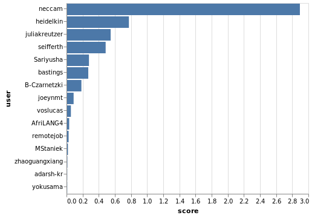
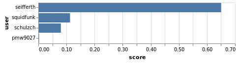
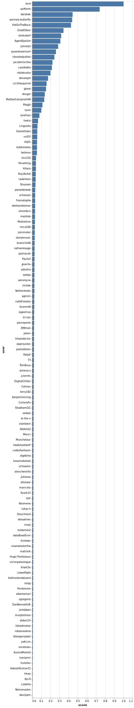

# Example Graphs Generated With Suits-You

## Custom Contribution Score Metric

0.0010674510649622772 · title_vocab + 0.00018704822234021535 · total_vocab + 0.0003511492858868812 · msg_vocab + 0.017832106167508615 · avg_msg_vocab

## Contribution Score Graph for [joeynmt/joeynmt]

## Contribution Score Graph for [schulzch/edit-distance-js]

## Contribution Score Graph for [brrd/Abricotine]

[joeynmt/joeynmt]: https://github.com/joeynmt/joeynmt
[schulzch/edit-distance-js]: https://github.com/schulzch/edit-distance-js
[brrd/Abricotine]: https://github.com/brrd/Abricotine
